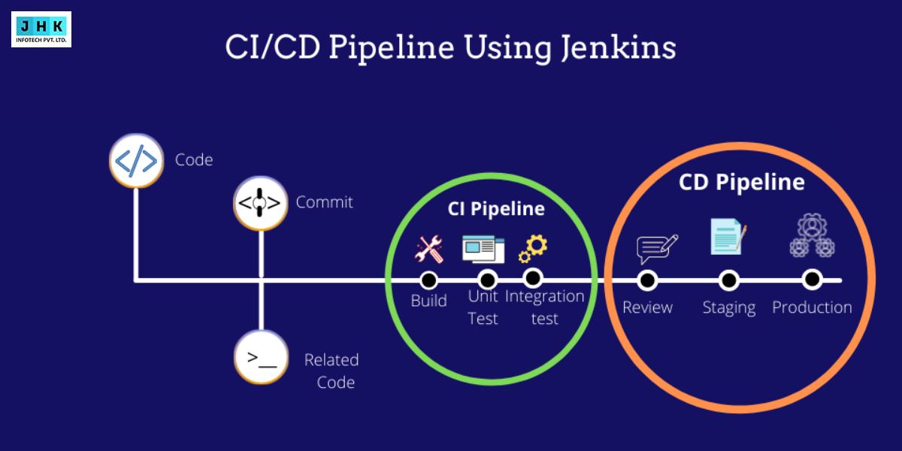
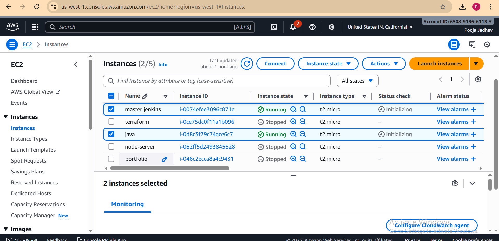
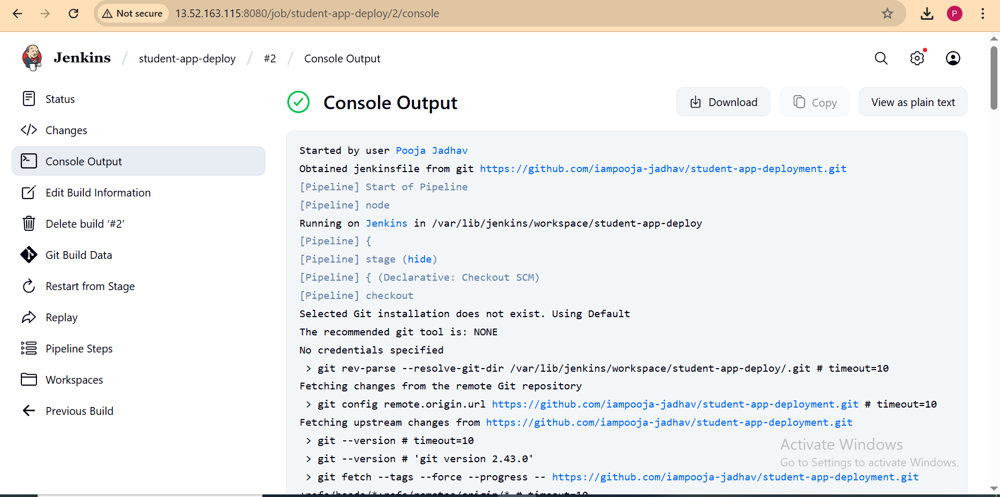
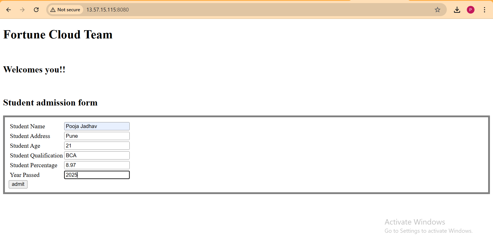

# Automated CI/CD Pipeline for Java Student Management Application

This repository demonstrates a Java-based Student Management Web Application deployed through a fully automated CI/CD pipeline using Git, GitHub, Jenkins, AWS EC2, Maven, and Apache Tomcat.

 
 ## 1. Project Overview
The Student Management Application allows users to input and manage student details such as name, address, age, qualification, percentage, and passing year.

This project highlights Continuous Integration and Continuous Deployment (CI/CD) using Jenkins and AWS infrastructure to automate the deployment process of Java applications.

## 1.Launch EC2 Instances

### Jenkins Credentials Setup

## 2. Project Objectives

### The pipeline is designed to automatically:

1. Clone the project from GitHub.
2. Build the Java application using Maven.
3. Generate a deployable .war file.
4. Transfer the .war file to a Tomcat server hosted on another EC2 instance.
5. Restart the Tomcat service to deploy the latest version.
6. Make the web app accessible on the browser automatically.

## 3. Tools and Technologies Used
##  Project Setup

| **Category** | **Tools / Technologies** |
|---------------|--------------------------|
| Programming Language |	Java   |
|  Build Tool |	Apache Maven| |
|  Version Control	|Git & GitHub|
| CI/CD Automation	| Jenkins |
| Cloud Platform |	AWS EC2 (Ubuntu) |
| Application Server |	Apache Tomcat 10|
| Pipeline Type	| Jenkins Declarative Pipeline |

## 4. CI/CD Workflow

The pipeline automates the entire process from code commit to deployment, ensuring a seamless development lifecycle.

## 5. Jenkinsfile (Pipeline Script)

Below is the Jenkinsfile used for building and deploying the Student Management Application automatically.

## 6. AWS EC2 Setup
| Instance| Purpose | Configuration |
|-----------|-----------|-----------|
| EC2-1 | Jenkins server| Ubuntu 22.04, Jenkins, Java, Maven, Git |
| EC2-2 | Application Server|Ubuntu 22.04, Apache Tomcat 10, Java |  

### SSH Configuration:

  ~ SSH key pair named checkkey created.
  
  ~ Private key added to Jenkins Credentials under “SSH Agent”.

~ Passwordless SSH established between   Jenkins and Tomcat EC2 instances.

## 7. Deployment Process Summary
1. Code changes pushed to GitHub repository.

2. Jenkins automatically detects the commit.

3. Maven builds and packages the project into a .war file.

4. Jenkins securely copies the .war file to the remote Tomcat server.

5. Tomcat automatically redeploys the application.

## 8. Verification and Screenshots
## 🚀 Project Deployment Details

| **Description** | **Screenshot** |
|------------------|----------------|
| **🔐 Jenkins Credential Setup**  Configured SSH key credentials in Jenkins for connecting to GitHub repository securely. |  |
| **🧾 Jenkins Console Output**  Build logs showing stages like checkout, build, and deploy executed successfully without any  error |
| **✅ Successful Deployment** 
 The project (Student Application Form) was deployed successfully using Jenkins pipeline on the server. |
|**Student Application Form**| |

## 9. Application Output
#### After deployment, the application displays a Student Admission Form with the following fields:

 Student Name
 
 Student Address

Student Age

Student Qualification

Student Percentage

Year Passed

The application runs successfully on the 

Tomcat 10 server hosted on AWS EC2.

## 10. Author
#### Pooja Jadhav DevOps | Cloud | CI/CD | GitHub: https://github.com/iampooja-jadhav 